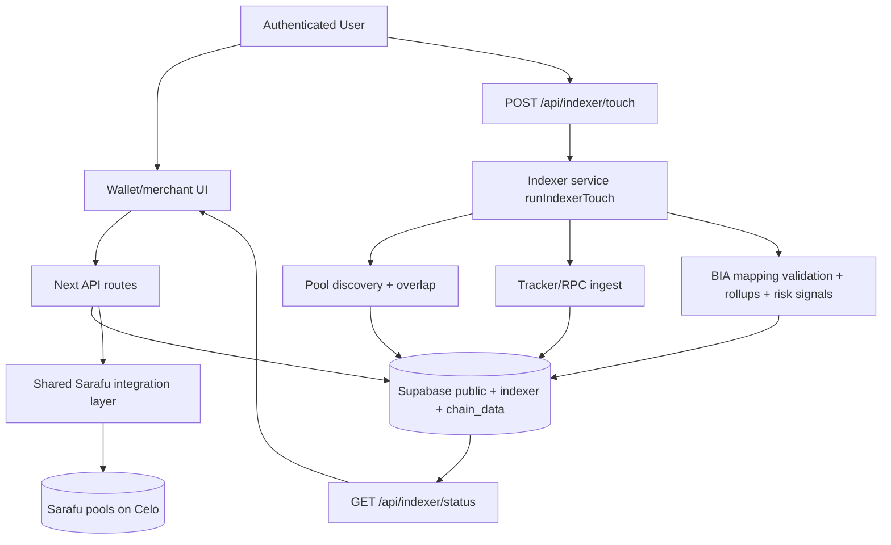

# BIA Pools + Indexer Tandem Architecture

## 1. Purpose
This document describes the implemented Neighbourhood/BIA pool system in Genero and how it works with the user-triggered indexer.

The release goal is to:
- Use Sarafu pools as on-chain pool infrastructure.
- Maintain BIA, affiliation, controls, and workflow state in Supabase.
- Extend the existing touch-triggered indexer to compute BIA-level operational/risk outputs.
- Route wallet buy/redeem actions through BIA-aware API flows.

## 2. High-Level Design

## 3. Source of Truth Boundaries
- BIA/app/workflow state: Supabase (`public` schema).
- Indexing control + derived analytics: Supabase (`indexer`, `chain_data`).
- Pool contract reality: Sarafu contracts on Celo.
- City token bundle reality: City registry (with fallback override logic already in repo).

## 4. Core Backend Components

### 4.1 Supabase schema/migration
Implemented in:
- `supabase/migrations/20260311110000_v0.96_bia_pools.sql`

Added major tables/views:
- `public.bia_registry`
- `public.bia_pool_mappings`
- `public.user_bia_affiliations`
- `public.store_profiles`
- `public.store_bia_affiliations`
- `public.pool_purchase_requests`
- `public.pool_redemption_requests`
- `public.pool_redemption_settlements`
- `public.bia_pool_controls`
- `public.store_risk_flags`
- `public.governance_actions_log`
- `indexer.bia_event_rollups`
- `indexer.bia_risk_signals`
- `public.v_bia_pool_health`
- `public.v_bia_activity_summary`

### 4.2 Shared server modules
Implemented in:
- `shared/lib/bia/*`
- `shared/lib/sarafu/*`

Responsibilities:
- Auth context + service-role access for BIA APIs.
- City/app-instance/user/store role resolution.
- BIA/store access guards.
- Sarafu pool routing + token-presence checks.
- Redemption risk guard checks (frozen pool, suspended store, limits).

### 4.3 API surface
Implemented in:
- `app/api/bias/*`
- `app/api/stores/*`
- `app/api/pools/buy/route.ts`
- `app/api/redemptions/*`
- `app/api/governance/actions/route.ts`

Main responsibilities:
- BIA registry and mapping operations.
- User/store affiliation updates.
- Buy request creation with BIA/pool attribution.
- Merchant redemption queue lifecycle (request/approve/settle).
- Governance/risk audit feed exposure.

## 5. Indexer Tandem Extensions
Implemented in:
- `services/indexer/src/bia.ts`
- `services/indexer/src/index.ts`
- `services/indexer/src/state/runControl.ts`
- `services/indexer/src/types.ts`
- `shared/lib/indexer/types.ts`

Added behavior:
1. Mapping validation sync
- Compares active `bia_pool_mappings` against latest discovery.
- Marks mappings `valid`, `stale`, or `mismatch`.

2. BIA rollup derivation
- Reads indexed `indexer.raw_events` in current run block range.
- Attributes events to BIA via discovered pool/component address graph.
- Writes per-block aggregates to `indexer.bia_event_rollups`.

3. BIA risk signals
- Combines pending redemption pressure with recent swap volume.
- Writes derived `redemption_pressure`, `concentration_score`, `stress_level` into `indexer.bia_risk_signals`.

4. Status enrichment
- `GET /api/indexer/status` now includes `biaSummary`:
  - active BIAs
  - mapped/unmapped pools
  - stale mappings
  - per-BIA last activity snapshot

## 6. Wallet Integration Points
Implemented in:
- `app/tcoin/wallet/components/modals/TopUpModal.tsx`
- `app/tcoin/wallet/components/modals/OffRampModal.tsx`

Current behavior:
- Top-up confirmation now calls `/api/pools/buy` to create a BIA-attributed pool purchase request record.
- Off-ramp flow, for store owners, now calls `/api/redemptions/request` after burn/accounting to queue BIA-attributed redemption settlement.

## 7. Security and Access Model
- API endpoints require authenticated Supabase session.
- Privileged mutations are gated by app-scoped `admin/operator` role checks.
- Store actions require store access (`store_employees`) unless admin/operator.
- Indexer writes continue to run with service-role context.
- Governance/risk writes emit audit rows in `governance_actions_log`.

## 8. Operational Constraints and Current Limits
- Indexing remains user-triggered with 5-minute start/complete cooldown semantics.
- BIA pool settlement is queue-driven and operator-mediated.
- Geospatial suggestion remains center-point distance based (no polygon containment in this implementation).
- Buy flow currently persists routed request state; on-chain tx execution remains an integration concern of wallet signing path.

## 9. Key Paths
- Migration: `supabase/migrations/20260311110000_v0.96_bia_pools.sql`
- New indexer BIA module: `services/indexer/src/bia.ts`
- New BIA API root: `app/api/bias`
- New redemption API root: `app/api/redemptions`
- Wallet integration touchpoints: `app/tcoin/wallet/components/modals/TopUpModal.tsx`, `app/tcoin/wallet/components/modals/OffRampModal.tsx`
