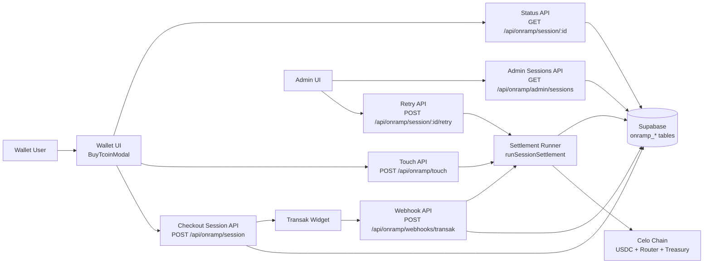
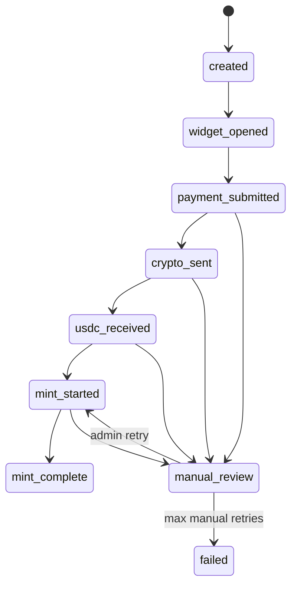

# Buy TCOIN Checkout Orchestrator Architecture

## Status
- Implemented in `v1.18` for `app/tcoin/wallet` with feature flag: `NEXT_PUBLIC_BUY_TCOIN_CHECKOUT_V1`.
- Provider v1: Transak only.
- Network/asset v1: Celo mainnet + USDC input, final asset TCOIN.

## Problem and Goal
The contract path (`TcoinMintRouter`) already supports atomic reserve minting (`USDC -> CADm -> TCOIN`), but wallet UX still required fragmented off-chain/on-chain steps.

This architecture adds a backend checkout orchestrator that turns the user experience into one lifecycle:
1. Create provider checkout session.
2. Track provider + chain settlement status.
3. Auto-mint TCOIN via router when USDC arrives.
4. Expose status/timeline to wallet and admin.

## Locked Decisions (Encoded)
1. Managed deposit custody model (per-user static deposit address).
2. Provider-first strategy: Transak only in v1.
3. Auto-mint with bounded retries; operator retry/escalation fallback.
4. Keep Interac as product fallback path.
5. Wallet app only for v1 UI scope.
6. Server env key management now; KMS/HSM is future hardening.

## Architecture Overview

## Components

### 1) Wallet Layer
- `BuyTcoinModal` creates checkout sessions, embeds the provider widget URL, polls status, and triggers touch processing.
- Entry points are added to wallet home and more tab under feature flag.
- Interac remains available as alternate path.

### 2) API Orchestration Layer (`app/api/onramp/*`)
- `POST /api/onramp/session`
  - Auth required.
  - Resolves user + app instance.
  - Gets/creates managed deposit wallet.
  - Persists checkout session.
  - Returns provider widget config.
- `GET /api/onramp/session/[id]`
  - Returns user/admin-visible session status + timeline projection.
- `POST /api/onramp/session/[id]`
  - Session action updates (v1: `widget_opened`).
- `POST /api/onramp/webhooks/transak`
  - Signature validation.
  - Event persistence.
  - Session status mapping.
  - Triggers settlement for eligible statuses.
- `POST /api/onramp/touch`
  - User-triggered bounded settlement runner for active/recent sessions.
- `POST /api/onramp/session/[id]/retry`
  - Admin/operator retry path for manual review/failed sessions.
- `GET /api/onramp/admin/sessions`
  - Admin/operator triage list.

### 3) Onramp Service Layer (`services/onramp/src`)
- `config.ts`: strict env parsing and defaults.
- `depositWallets.ts`: deterministic derivation and DB allocation for per-user deposit wallets.
- `provider/transak.ts`: widget construction + webhook normalization + signature verification.
- `settlement.ts`: lock, detect USDC, quote/guard rails, gas top-up, mint call, persistence, retry/manual-review transitions.
- `status.ts`: response projection including timeline.

### 4) Chain Execution Layer
- Uses existing `TcoinMintRouter.mintTcoinWithUSDC(...)`.
- Router enforces min-out/deadline + atomic revert semantics.
- Settlement runner performs:
  1. USDC balance check at deposit wallet.
  2. Router preview quote.
  3. Slippage guard calculation (`slippageBps`, default 100 bps).
  4. Deadline guard (`deadlineSeconds`, default 900 sec).
  5. Approval + mint tx from deposit wallet.

### 5) Persistence Layer
- New migration `v0.98` adds:
  - `onramp_deposit_wallets`
  - `onramp_checkout_sessions`
  - `onramp_settlement_attempts`
  - `onramp_provider_events`
  - `onramp_operation_locks`
  - `v_onramp_checkout_admin`
  - lock RPCs: `onramp_try_acquire_lock`, `onramp_release_lock`

## Session Lifecycle and State Machine

### Canonical statuses
- `created`
- `widget_opened`
- `payment_submitted`
- `crypto_sent`
- `usdc_received`
- `mint_started`
- `mint_complete`
- `manual_review`
- `failed`

### State progression

### Important mapping rule
Provider `completed/success` is mapped to `crypto_sent` (not `mint_complete`).
`mint_complete` is reserved for confirmed router execution.

## Settlement Algorithm (Simplified)
1. Acquire per-session lock (`onramp_try_acquire_lock`).
2. Load session, short-circuit terminal states.
3. Enforce attempt limits by mode (`auto` or `manual_operator`).
4. Detect settled USDC on deposit wallet.
5. If not settled and timed out -> `manual_review`; else skip.
6. Resolve requested charity (user profile preference fallback 0).
7. Preview router quote and compute:
   - `minCadmOut = quoteCadmOut * (1 - slippageBps)`
   - `minTcoinOut = quoteTcoinOut * (1 - slippageBps)`
   - `deadline = now + deadlineSeconds`
8. Ensure deposit wallet gas (JIT CELO top-up from gas bank).
9. Approve USDC to router and call `mintTcoinWithUSDC`.
10. Persist tx hashes, amounts, attempt result, and final status.
11. Optionally write purchase attribution + governance action log.
12. Release lock.

## Security Controls
1. Webhook HMAC signature validation before processing.
2. Idempotency via event upsert keys and per-session lock.
3. Retry limits for auto/manual modes.
4. Explicit guard rails for deadline/slippage.
5. Secrets server-side only (`ONRAMP_*`), never sent to client except safe widget config.
6. Admin-only retry and admin-list routes.
7. Full attempt/event/session auditability in DB + governance action log writes.

## Data Contracts

### API surfaces
- `POST /api/onramp/session`
- `GET /api/onramp/session/:id`
- `POST /api/onramp/session/:id`
- `POST /api/onramp/webhooks/transak`
- `POST /api/onramp/touch`
- `POST /api/onramp/session/:id/retry`
- `GET /api/onramp/admin/sessions`

### Shared types
- `OnrampCheckoutSession`
- `OnrampSessionStatus`
- `OnrampSessionTimelineStep`
- `OnrampAdminSessionSummary`

## Operations and Monitoring

### SLA behavior
- Auto-mint attempts within 10-minute session timeout window.
- On timeout/max attempts: session transitions to `manual_review`.
- Operator can retry up to manual attempt cap.

### Key operational signals
1. Session counts by status.
2. Time-to-mint (`created -> mint_complete`).
3. Auto attempt success/failure rate.
4. Manual review queue depth and age.
5. Top failure reasons from `onramp_settlement_attempts.error_message`.

## Failure Modes and Handling
1. Invalid webhook signature -> reject 401, no state mutation.
2. Provider event without matched session -> event stored, no settlement.
3. No USDC detected yet -> non-terminal skip (until timeout threshold).
4. Quote/chain execution failures -> attempt failure logged; status remains recoverable or `manual_review` based on timeout/limits.
5. Concurrent webhook/touch/retry -> lock prevents duplicate mint execution.

## Configuration
Required runtime keys are in `.env.local.example` under Buy TCOIN section, including:
- provider keys/secrets (`ONRAMP_TRANSAK_*`)
- chain/router/token addresses
- HD seed/derivation path
- gas bank key + top-up thresholds
- slippage/deadline/attempt controls

## Coexistence and Compatibility
1. Interac on-ramp remains supported and visible.
2. Existing `/api/pools/buy` behavior is preserved; onramp writes attribution compatible with current BIA accounting paths.
3. Existing indexer trigger/cooldown model is unchanged.

## Deferred / Future Phase
1. KMS/HSM signing custody hardening.
2. Multi-provider failover (Onramper/Ramp, etc.).
3. Optional push/event-stream status updates instead of polling.
4. Optional dynamic quote engines per swap adapter policy.
5. Broader city support beyond `tcoin` after v1 operational validation.
