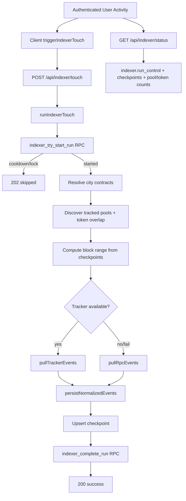

# Genero Indexer Architecture (Session v1.07)

## Purpose
Session `v1.07` introduced a user-triggered indexer for city contracts and Sarafu-overlap pools. The design prioritizes:
- Safe, idempotent ingestion with bounded run windows.
- Triggering from real user activity instead of cron-only infrastructure.
- Tracker-first ingestion with automatic RPC fallback.
- Read-optimized indexed tables with strict write boundaries.
- ABI-accurate Sarafu reads (`SwapPool`, `PriceIndexQuoter`, `Limiter`) instead of guessed function names.

## High-Level Flow

## Components

### 1. Trigger Surfaces
- Auth sign-in trigger: `shared/api/hooks/useAuth.ts`.
- App heartbeat/focus triggers via hook: `shared/hooks/useIndexerTrigger.ts`.
- Hook is wired in:
- `app/tcoin/wallet/ContentLayout.tsx`
- `app/tcoin/sparechange/ContentLayout.tsx`
- `app/tcoin/contracts/hooks/useManagementContext.ts`

### 2. Client Trigger Utility
- File: `shared/lib/indexer/trigger.ts`.
- Adds local cooldown (`5 minutes`) with in-memory + `localStorage` dedupe.
- Calls `POST /api/indexer/touch` and `GET /api/indexer/status`.
- Supports bypass flag for explicit/manual retrigger behavior.

### 3. API Layer
- `POST /api/indexer/touch`: `app/api/indexer/touch/route.ts`.
- Requires authenticated user.
- Executes indexer using service-role Supabase client.
- Returns `202` on cooldown/skip, `200` on success, `500` on run error.
- `GET /api/indexer/status`: `app/api/indexer/status/route.ts`.
- Requires authenticated user.
- Returns run control status, checkpoints, active pool/token counts.

### 4. Indexer Service Orchestrator
- Entry: `services/indexer/src/index.ts`.
- Sequence:
1. Resolve config and scope (`citySlug:chainId`).
2. Attempt atomic start (`indexer_try_start_run`).
3. Resolve city contracts (registry-first, DB override fallback).
4. Discover tracked pools and overlapping token universe.
5. Compute bounded block range from latest checkpoints.
6. Pull events from tracker when available; fallback to RPC logs.
7. Normalize/persist events and derived chain-data rows.
8. Upsert source checkpoint.
9. Complete run (`indexer_complete_run`) with `success` or `error`.

### 5. City Contract Resolution
- File: `services/indexer/src/discovery/cityContracts.ts`.
- Primary source: active city contract registry (`getActiveCityContracts`).
- Fallback source: `indexer.city_contract_overrides`.
- Guarantees at least `TCOIN` is available before indexing.

### 6. Pool Discovery and Address Tracking
- File: `services/indexer/src/discovery/pools.ts`.
- Reads pools from Sarafu pool index contract.
- Reads and refreshes full on-chain pool tuple every discovery run:
- `tokenRegistry()`, `tokenLimiter()`, `quoter()`, `owner()`, `feeAddress()`.
- Forces inclusion of required baseline pool/components from config constants.
- Includes pools when:
- pool token set overlaps with city token set (`TCOIN/TTC/CAD`), or
- pool is required baseline.
- Persists discovery into:
- `indexer.pool_links`
- `indexer.pool_tokens`
- `chain_data.pools`
- `chain_data.tokens` (best-effort ERC20 metadata)
- Deactivates stale pools not seen in current discovery pass.
- Syncs mapping validation status and flags tuple mismatches when DB mapping components diverge from on-chain values.

### 7. Ingestion Sources
- Tracker source: `services/indexer/src/ingest/trackerClient.ts`.
- POST pull by scope/city/chain/block-range/address set.
- Normalizes into internal event shape.
- RPC source: `services/indexer/src/ingest/rpcFallback.ts`.
- Uses `viem` `getLogs` over tracked addresses in chunks.
- Maps topic signatures to event types (`TRANSFER`, `MINT`, `BURN`, `SWAP`, `DEPOSIT`, `OWNERSHIP_TRANSFERRED`).
- Decodes payloads when ABI match succeeds; stores raw fallback payload otherwise.
- Event ABI names are aligned to Sarafu contracts (`_minter`, `_burner`, `_beneficiary`, `_value`, etc.).

### 7.1 Sarafu ABI Truths Used
- Quoter pricing path: `valueFor(address _outToken, address _inToken, uint256 _value)`.
- Swap path (wallet execution): `withdraw(address _outToken, address _inToken, uint256 _value)`.
- Pool quote preflight: `getQuote(address _outToken, address _inToken, uint256 _value)`.
- Limit read path: `limitOf(address token, address holder)`.

### 8. Normalization and Persistence
- Fingerprint builder: `services/indexer/src/normalize/fingerprint.ts`.
- Stable payload serialization + keccak fingerprint for idempotency.
- Persistence: `services/indexer/src/normalize/persist.ts`.
- Upserts raw events into `indexer.raw_events` keyed by unique fingerprint.
- Writes derived rows into `chain_data` tables:
- `tx`
- `token_transfer`
- `token_mint`
- `token_burn`
- `pool_swap`
- `pool_deposit`
- `ownership_change`

### 9. Run Control and Checkpoints
- File: `services/indexer/src/state/runControl.ts`.
- Scope key format: `<citySlug>:<chainId>`.
- Stores and reads per-source checkpoints (`tracker` and `rpc`).
- Reads status summary for API exposure.
- Uses DB RPCs for atomic lifecycle state transitions.

## Data Model
Migration: `supabase/migrations/20260309191000_v0.95_user_triggered_indexer.sql`.

### Schemas
- `indexer`: control plane and raw events.
- `chain_data`: normalized analytical/event tables.

### Core `indexer` Tables
- `run_control`: lifecycle state, cooldown windows, last error/status.
- `checkpoints`: last indexed block/tx hash per scope and source.
- `pool_links`: discovered pools and related component addresses.
- `pool_tokens`: pool-to-token relationships.
- `raw_events`: idempotent raw event storage (`UNIQUE fingerprint`).
- `city_contract_overrides`: bootstrap fallback when registry not ready.

### Core `chain_data` Tables
- `tx`, `token_transfer`, `token_mint`, `token_burn`, `pool_swap`, `pool_deposit`, `ownership_change`, `tokens`, `pools`.

## Cooldown and Concurrency Design
- Client-side cooldown: local 5-minute dedupe to reduce redundant API calls.
- Server-side cooldown: enforced in `indexer_try_start_run` and `indexer_complete_run`.
- Concurrency guard: advisory lock by `scope_key` in `indexer_try_start_run`.
- Result: burst user actions remain safe and mostly no-op after first accepted touch.

## Security Model
- API routes require authenticated user.
- Mutations run only through service-role path in backend.
- `authenticated` role gets `SELECT` on indexer/chain_data; write rights revoked.
- RPC lifecycle functions are `SECURITY DEFINER` and executable only by `service_role`.

## Config Surface
Defined in `services/indexer/src/config.ts`.
- `INDEXER_CHAIN_ID` (default `42220`)
- `INDEXER_CHAIN_RPC_URL` (default `https://forno.celo.org`)
- `INDEXER_INITIAL_BLOCK` (default `0`)
- `INDEXER_MAX_BLOCKS_PER_RUN` (default `2000`)
- `INDEXER_DISCOVERY_POOL_LIMIT` (default `500`)
- `INDEXER_TRACKER_PULL_URL` (optional)
- `NEXT_PUBLIC_CITYCOIN` (default `tcoin`)

## Status and Observability
- API endpoint: `GET /api/indexer/status`.
- Returns:
- `runControl` (timestamps, state, cooldown eligibility, last error)
- source checkpoints (`tracker` and `rpc`)
- active pool count and distinct active token count
- `biaSummary.componentMismatches` for strict DB-vs-chain pool component mismatch diagnostics.

## Failure Handling
- Tracker pull failure automatically falls back to RPC in same run.
- Persistence is idempotent through fingerprint uniqueness and conflict upserts.
- Run completion records error status and message for diagnostics.
- If no new block range exists, run closes successfully with zero ingested events.

## Known Tradeoffs (v1.07)
- Trigger strategy is user-activity-based rather than always-on daemon indexing.
- Block ingestion is intentionally bounded per run (`maxBlocksPerRun`) to limit request cost/latency.
- Event decoding is ABI best-effort for unknown logs; undecodable logs still persist with raw payload details.

## Source Map
- Migration and DB control plane:
- `supabase/migrations/20260309191000_v0.95_user_triggered_indexer.sql`
- Indexer orchestration:
- `services/indexer/src/index.ts`
- Run control:
- `services/indexer/src/state/runControl.ts`
- Discovery:
- `services/indexer/src/discovery/cityContracts.ts`
- `services/indexer/src/discovery/pools.ts`
- Ingestion:
- `services/indexer/src/ingest/trackerClient.ts`
- `services/indexer/src/ingest/rpcFallback.ts`
- Normalization/persistence:
- `services/indexer/src/normalize/fingerprint.ts`
- `services/indexer/src/normalize/persist.ts`
- API routes:
- `app/api/indexer/touch/route.ts`
- `app/api/indexer/status/route.ts`
- Client trigger/hook:
- `shared/lib/indexer/trigger.ts`
- `shared/hooks/useIndexerTrigger.ts`
