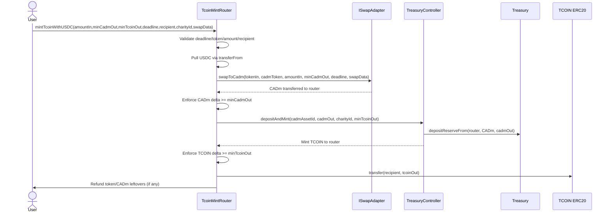

# `mintTcoinWithUSDC` Architecture

## 1. Problem and Goal
Without a router, users face multi-step operations:
1. swap input token (for example USDC) to CADm
2. mint TCOIN using CADm

This increases signature count, partial-failure surface area, and support burden.

Goal: collapse this into one user transaction while preserving reserve-backed issuance rules already implemented in the TorontoCoin treasury stack.

## 2. Component Model
1. `TcoinMintRouter`
- user-facing orchestration layer
- enforces deadline/slippage/refunds

2. `ISwapAdapter`
- abstracts tokenIn -> CADm execution venue
- replaceable by governance/owner config
- the recommended concrete implementation is `MentoBrokerSwapAdapter`
- supports admin-set default broker routes and optional per-call route override via `swapData`

3. `TreasuryController` (via `ITreasuryMinting`)
- canonical reserve-backed mint path
- validates reserve asset, pricing, and charity uplift

4. `Treasury`
- pure reserve vault
- receives the CADm reserve deposit when the controller mint path executes

## 3. On-Chain Sequence (Happy Path)

## 4. Failure Paths
### 4.1 Deadline exceeded
- Router reverts with `DeadlineExpired` before token movement.

### 4.2 Swap under-delivers
- Router compares CADm balance delta to `minCadmOut` and reverts atomically.

### 4.3 Treasury-controller mint under-delivers
- Router compares TCOIN balance delta to `minTcoinOut` and reverts atomically.

### 4.4 Adapter callback/reentrancy attempt
- Entry functions are `nonReentrant`; callback attempt fails.

## 5. Why This Is UX-Simpler
User sees one action: `Buy TCOIN`.

User does not need to manually manage:
- intermediate CADm balances
- multi-step signatures
- partial completion states

Outcome is binary:
- success: user receives TCOIN
- failure: full revert

## 6. Public Contract Surface Added
1. `mintTcoinWithToken(...)`
2. `mintTcoinWithUSDC(...)`
3. `previewMintTcoinWithToken(...)`
4. `ISwapAdapter` interface
5. `ITreasuryMinting` interface

## 7. Off-Chain Quote Pattern
Backend/UI quoting should:
1. call adapter preview for CADm estimate
2. call treasury preview for TCOIN estimate
3. apply client slippage buffers
4. submit `minCadmOut` and `minTcoinOut`

On-chain remains final source of truth for acceptance/rejection.

## 8. Rollout
1. Deploy router with treasury, CADm token, CADm assetId, and a configured `MentoBrokerSwapAdapter`.
2. Enable USDC as input token.
3. Configure the default Mento route for USDC (or pass an override through `swapData`).
4. Validate preview-vs-execution drift in staging.
5. Enable wallet feature flag for one-click reserve mint.
6. Monitor revert distribution, output slippage, and refund frequency.
