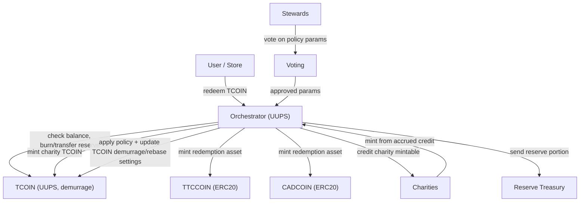

# TorontoCoin Contracts: Current State and Deployability Plan

## Scope
This document covers the imported contracts in `contracts/foundry/src/torontocoin`:
- `TCOIN.sol`
- `TTCCOIN.sol`
- `CADCOIN.sol`
- `Orchestration.sol`
- `Voting.sol`
- `PlainERC20.sol` (standalone template)
- `sampleERC20.sol` (duplicate-style sample)

## Current State Summary
- The intended architecture is sound: `Orchestrator` coordinates redemptions between `TCOIN`, `TTC`, and `CAD`, and `Voting` proposes policy updates.
- As checked into this repo today, the system is **not deployable** due to dependency/import issues plus multiple critical logic bugs.

### Build and Dependency Status
- `forge build` currently fails because OpenZeppelin dependencies are not installed/remapped in `contracts/foundry`.
- Required packages include both:
  - `@openzeppelin/contracts`
  - `@openzeppelin/contracts-upgradeable`

## Corrected Interaction Diagram
This diagram shows the corrected end-to-end flow and trust boundaries.

## Contract Interfaces

### `TCOIN.sol` (`contract TCOIN`)
- Type: UUPS-upgradeable ERC20 (`Initializable`, `ERC20Upgradeable`, `OwnableUpgradeable`, `UUPSUpgradeable`).
- Initialization and upgrade controls:
- `initialize()` sets token metadata and rebase defaults.
- `_authorizeUpgrade(address)` is owner-gated (`onlyOwner`).
- Supply and balance surface:
- `totalSupply()` returns the custom `totalTCOINSupply` tracker (not the base ERC20 total).
- `balanceOf(address)` overrides ERC20 balance reads.
- Mint/burn and transfer surface:
- `mint(address to, uint256 amount)` is restricted to whitelisted stores.
- `burn(address from, uint256 amount)` is restricted to whitelisted stores.
- `transfer(address recipient, uint256 amount)` overrides ERC20 transfer behavior.
- Monetary policy surface:
- `rebase()` applies demurrage after `REBASE_PERIOD`.
- `updateDemurrageRate(uint256)` and `updateRebasePeriod(uint256)` are owner-only.
- Orchestration and whitelist surface:
- `setOrchestrator(address)` is owner-only.
- `whitelistStore(address)` and `removeStoreFromWhitelist(address)` are orchestrator-only.
- Read-only metadata and accounting getters:
- `getTotalRawSupply()`, `getTotalTCOINSupply()`, `getDemurrageRate()`, `getRebasePeriod()`.

### `TTCCOIN.sol` (`contract TTC`)
- Type: ERC20 with role-based minting and pause controls (`ERC20`, `AccessControl`, `Pausable`).
- Role model:
- `OWNER_ROLE` administers pausing and minter-role assignment.
- `MINTER_ROLE` can mint.
- Constructor grants both roles to deployer and configures role admins.
- Token operations:
- `mint(address to, uint256 amount)` requires `MINTER_ROLE` and contract not paused.
- `burn(uint256 amount)` burns caller tokens while not paused.
- Admin controls:
- `pause()` and `unpause()` require `OWNER_ROLE`.
- Supply/accounting getters:
- `getTotalMinted()` and `getTotalBurned()`.
- Inherited ERC20 interface remains available (`transfer`, `approve`, `transferFrom`, `allowance`, etc.).

### `CADCOIN.sol` (`contract CAD`)
- Type: ERC20 with role-based minting and pause controls (`ERC20`, `AccessControl`, `Pausable`).
- Role model:
- `OWNER_ROLE` controls pause/unpause.
- `MINTER_ROLE` controls minting.
- Constructor assigns both roles to deployer.
- Token operations:
- `mint(address to, uint256 amount)` requires `MINTER_ROLE` and contract not paused.
- `burn(uint256 amount)` burns caller tokens while not paused.
- Admin controls:
- `pause()` and `unpause()` require `OWNER_ROLE`.
- Supply/accounting getters:
- `getTotalMinted()` and `getTotalBurned()`.
- Inherited ERC20 interface remains available (`transfer`, `approve`, `transferFrom`, `allowance`, etc.).

### `Orchestration.sol` (`contract Orchestrator`)
- Type: UUPS-upgradeable coordinator (`Initializable`, `OwnableUpgradeable`, `UUPSUpgradeable`) that composes `TCOIN`, `TTC`, `CAD`, and `Voting`.
- Initialization and upgrade controls:
- `initialize(...)` wires token/voting addresses and initial policy parameters.
- `_authorizeUpgrade(address)` is owner-gated (`onlyOwner`).
- Address wiring/admin setters (owner-only):
- `setTcoinAddress(address)`, `setTtcAddress(address)`, `setCadAddress(address)`.
- Governance sync surface:
- `updateValuesAfterVoting()` pulls policy values from `Voting`.
- Policy/state getters:
- `getPegValue()`, `getStewardCount()`, `getRedemptionRateUserTTC()`, `getRedemptionRateStoreTTC()`, `getRedemptionRateUserCAD()`, `getRedemptionRateStoreCAD()`, `getMinimumReserveRatio()`, `getMaximumReserveRatio()`, `getDemurrageRate()`, `getReserveRatio()`.
- Charity and steward management:
- `addCharity(uint256 id, string name, address charity)` (owner-only).
- `isCharity(address)` view helper.
- `nominateSteward(uint256 stewardId, string name, address stewardAddress)`.
- `isSteward(address)` view helper.
- Monetary policy and reserve ops:
- `calculateReserveRatio()` view helper.
- `rebaseTCOIN()`, `updateDemurrageRate(uint256)`, `updateRebasePeriod(uint256)` (owner-only wrappers into `TCOIN`).
- Redemption entrypoints (user/store, TTC/CAD, with and without explicit charity id):
- `redeemTCOINTTCCOIN(uint256, uint256)`.
- `redeemTCOINFCADCOIN(uint256, uint256)`.
- `redeemTCOINForUserTTCCOIN(uint256)` and `redeemTCOINForUserTTCCOIN(uint256, uint256)`.
- `redeemTCOINForStoreTTCCOIN(uint256)` and `redeemTCOINForStoreTTCCOIN(uint256, uint256)`.
- `redeemTCOINForUserCADCOIN(uint256)` and `redeemTCOINForUserCADCOIN(uint256, uint256)`.
- `redeemTCOINForStoreCADCOIN(uint256)` and `redeemTCOINForStoreCADCOIN(uint256, uint256)`.
- Charity minting flow:
- `mintTCOINForCharity(uint256)` allows a charity to mint up to its accrued allowance.

### `Voting.sol` (`contract Voting`)
- Type: owner-initialized governance module (`Initializable`, `OwnableUpgradeable`) with steward-gated voting via `Orchestrator.isSteward`.
- Initialization:
- `initialize(address orchestrator)` snapshots initial governance parameters from `Orchestrator`.
- Parameter getters:
- `getPegValue()`, `getRedemptionRateUserTTC()`, `getRedemptionRateStoreTTC()`, `getRedemptionRateUserCAD()`, `getRedemptionRateStoreCAD()`, `getMinimumReserveRatio()`, `getMaximumReserveRatio()`, `getDemurrageRate()`, `getReserveRatio()`.
- Voting entrypoints:
- `voteToUpdatePegValue(uint256 proposedPegValue)` for peg selection.
- `voteToUpdateValues(...)` for multi-parameter increment/decrement/leave voting via `VoteOption`.
- Exposed governance state:
- `orchestrator` (public reference), `pegValue`, parameter fields, and mappings/arrays (`pegValueVoteCounts`, `hasVoted`, `stewardVotes`, `proposedPegValues`, `votes`, `stewardVotesAll`).

### `PlainERC20.sol` (`contract MyToken`)
- Type: generic template token (`ERC20`, `ERC20Burnable`, `ERC20Pausable`, `AccessControl`, `ReentrancyGuard`).
- Constructor interface:
- `constructor(string name, string symbol, address admin)` assigns `DEFAULT_ADMIN_ROLE`, `MINTER_ROLE`, and `PAUSER_ROLE` to `admin`.
- Role-controlled methods:
- `mint(address to, uint256 amount)` requires `MINTER_ROLE`.
- `pause()` and `unpause()` require `PAUSER_ROLE`.
- Transfer hook:
- `_beforeTokenTransfer(address from, address to, uint256 amount)` enforces pause checks.
- Inherited interfaces include standard ERC20 + burnable surface (`transfer`, `approve`, `transferFrom`, `burn`, `burnFrom`, etc.).

### `sampleERC20.sol` (`contract TCOIN` sample/duplicate)
- Type: alternate/sample copy of `TCOIN` with the same broad surface (upgradeable ERC20 + orchestrator-controlled store whitelist + rebase/mint/burn getters).
- Public/external interface mirrors the core shape of `TCOIN.sol`:
- Lifecycle/admin: `initialize()`, `setOrchestrator(address)`, `updateDemurrageRate(uint256)`, `updateRebasePeriod(uint256)`, `rebase()`.
- Whitelist: `whitelistStore(address)`, `removeStoreFromWhitelist(address)`.
- Token/accounting: `transfer(address,uint256)`, `mint(address,uint256)`, `burn(address,uint256)`, `totalSupply()`, `balanceOf(address)`.
- Getters: `getTotalRawSupply()`, `getTotalTCOINSupply()`, `getDemurrageRate()`, `getRebasePeriod()`.
- Note: this file appears to be a non-production duplicate and should not be treated as canonical over `TCOIN.sol`.

## Patch List to Make Deployable End-to-End

### P0: Critical correctness fixes (must do first)
1. Fix recursive `balanceOf` in `TCOIN`.
- Replace `return balanceOf(account);` with `return super.balanceOf(account);`.

2. Fix `TCOIN.transfer` semantics.
- Remove mint-on-transfer behavior.
- Use standard transfer behavior (`super.transfer`) and keep supply/accounting coherent.

3. Fix wrong token usage in store CAD redemption.
- In `Orchestrator.redeemTCOINForStoreCADCOIN`, replace `ttc.mint/transfer` with `cad.mint/transfer`.

4. Fix demurrage getter wiring.
- `Orchestrator.getDemurrageRate` and `Voting.getDemurrageRate` should return `demurrageRate`, not `redemptionRateUserCAD`.

5. Fix charity registration mapping.
- In `addCharity`, set `isCharityAddress[charity] = true;`.

6. Fix steward lookup/data model mismatch.
- Current `isSteward` assumes contiguous IDs `0..stewardCount-1`, but nomination accepts arbitrary IDs.
- Use `mapping(address => bool) isStewardAddress` or track steward IDs in an array.

7. Fix peg-value voting mechanism.
- Add function(s) to register allowed peg proposals (`proposedPegValues.push(...)`) and dedupe proposals.

### P1: Deployability and role/bootstrap fixes
1. Install OpenZeppelin dependencies and set remappings.
- Add `openzeppelin-contracts` and `openzeppelin-contracts-upgradeable` under `lib/`.
- Ensure remappings resolve `@openzeppelin/...` imports.

2. Rationalize role admin model for `CAD` and `TTC`.
- Ensure deployer has `DEFAULT_ADMIN_ROLE` or explicit role admin settings enabling `grantRole`.
- Grant `MINTER_ROLE` to `Orchestrator` after deployment.

3. Fix `TCOIN` whitelist bootstrap flow.
- Today, `whitelistStore` is `onlyOrchestrator` but there is no orchestration path to bootstrap stores cleanly.
- Add owner-governed bootstrap method(s) or controlled setup function in `Orchestrator`.

4. Prevent initialization deadlock in `Orchestrator`.
- `initialize()` currently computes reserve ratio and reverts if raw supply is zero.
- Either defer reserve ratio init until first mint, or initialize safely when supply is zero.

5. Restrict `updateValuesAfterVoting`.
- Add access control (e.g., `onlyOwner` or governance role) to avoid arbitrary external triggering.

### P2: Economic and governance hardening
1. Normalize math scales and constants.
- Reserve ratio uses 1e6 scale; some formulas use `/10000` and become inconsistent.
- Standardize precision constants and document units.

2. Rework vote accounting.
- `hasVoted` is shared across unrelated vote types and `resetVotesForSteward` does not decrement tallies.
- Use per-proposal/per-parameter vote ledgers with explicit epochs.

3. Make read getters `view` consistently.
- Several getters are missing `view` and should be pure read calls.

4. Remove or archive duplicate/non-production files.
- `sampleERC20.sol` duplicates TCOIN behavior and can confuse build/review.
- Keep `PlainERC20.sol` only if explicitly needed as a template.

5. Add end-to-end tests before deployment.
- Unit: token accounting and role checks.
- Integration: redemption paths and charity crediting.
- Governance: voting thresholds and parameter propagation.

## Suggested Deployment Sequence (after fixes)
1. Deploy `TCOIN` proxy + initialize.
2. Deploy `TTCCOIN` and `CADCOIN`.
3. Deploy `Orchestrator` proxy + initialize with token addresses and treasury/charity config.
4. Deploy `Voting` + initialize with Orchestrator address.
5. Set `Voting` address in Orchestrator if needed, and set `Orchestrator` address in `TCOIN`.
6. Grant `MINTER_ROLE` on `TTC` and `CAD` to `Orchestrator`.
7. Configure allowed stores/charities/stewards.
8. Run smoke tests on redemption and governance before mainnet release.
