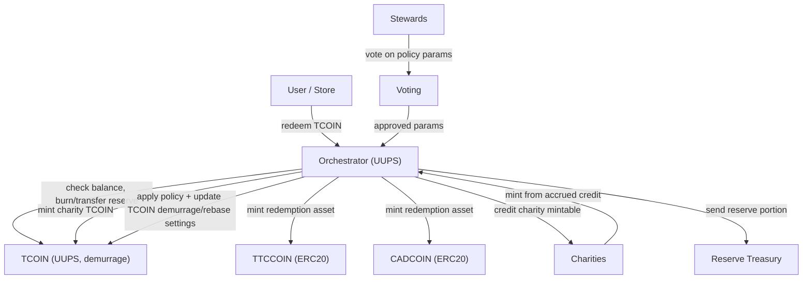

# TorontoCoin Contracts: Current State and Deployability Plan

## Scope
This document covers the imported contracts in `contracts/foundry/src/torontocoin`:
- `TCOIN.sol`
- `TTCCOIN.sol`
- `CADCOIN.sol`
- `Orchestration.sol`
- `Voting.sol`
- `PlainERC20.sol` (standalone template)
- `sampleERC20.sol` (duplicate-style sample)

## Current State Summary
- The intended architecture is sound: `Orchestrator` coordinates redemptions between `TCOIN`, `TTC`, and `CAD`, and `Voting` proposes policy updates.
- As checked into this repo today, the system is **not deployable** due to dependency/import issues plus multiple critical logic bugs.

### Build and Dependency Status
- `forge build` currently fails because OpenZeppelin dependencies are not installed/remapped in `contracts/foundry`.
- Required packages include both:
  - `@openzeppelin/contracts`
  - `@openzeppelin/contracts-upgradeable`

## Corrected Interaction Diagram
This diagram shows the corrected end-to-end flow and trust boundaries.

## Patch List to Make Deployable End-to-End

### P0: Critical correctness fixes (must do first)
1. Fix recursive `balanceOf` in `TCOIN`.
- Replace `return balanceOf(account);` with `return super.balanceOf(account);`.

2. Fix `TCOIN.transfer` semantics.
- Remove mint-on-transfer behavior.
- Use standard transfer behavior (`super.transfer`) and keep supply/accounting coherent.

3. Fix wrong token usage in store CAD redemption.
- In `Orchestrator.redeemTCOINForStoreCADCOIN`, replace `ttc.mint/transfer` with `cad.mint/transfer`.

4. Fix demurrage getter wiring.
- `Orchestrator.getDemurrageRate` and `Voting.getDemurrageRate` should return `demurrageRate`, not `redemptionRateUserCAD`.

5. Fix charity registration mapping.
- In `addCharity`, set `isCharityAddress[charity] = true;`.

6. Fix steward lookup/data model mismatch.
- Current `isSteward` assumes contiguous IDs `0..stewardCount-1`, but nomination accepts arbitrary IDs.
- Use `mapping(address => bool) isStewardAddress` or track steward IDs in an array.

7. Fix peg-value voting mechanism.
- Add function(s) to register allowed peg proposals (`proposedPegValues.push(...)`) and dedupe proposals.

### P1: Deployability and role/bootstrap fixes
1. Install OpenZeppelin dependencies and set remappings.
- Add `openzeppelin-contracts` and `openzeppelin-contracts-upgradeable` under `lib/`.
- Ensure remappings resolve `@openzeppelin/...` imports.

2. Rationalize role admin model for `CAD` and `TTC`.
- Ensure deployer has `DEFAULT_ADMIN_ROLE` or explicit role admin settings enabling `grantRole`.
- Grant `MINTER_ROLE` to `Orchestrator` after deployment.

3. Fix `TCOIN` whitelist bootstrap flow.
- Today, `whitelistStore` is `onlyOrchestrator` but there is no orchestration path to bootstrap stores cleanly.
- Add owner-governed bootstrap method(s) or controlled setup function in `Orchestrator`.

4. Prevent initialization deadlock in `Orchestrator`.
- `initialize()` currently computes reserve ratio and reverts if raw supply is zero.
- Either defer reserve ratio init until first mint, or initialize safely when supply is zero.

5. Restrict `updateValuesAfterVoting`.
- Add access control (e.g., `onlyOwner` or governance role) to avoid arbitrary external triggering.

### P2: Economic and governance hardening
1. Normalize math scales and constants.
- Reserve ratio uses 1e6 scale; some formulas use `/10000` and become inconsistent.
- Standardize precision constants and document units.

2. Rework vote accounting.
- `hasVoted` is shared across unrelated vote types and `resetVotesForSteward` does not decrement tallies.
- Use per-proposal/per-parameter vote ledgers with explicit epochs.

3. Make read getters `view` consistently.
- Several getters are missing `view` and should be pure read calls.

4. Remove or archive duplicate/non-production files.
- `sampleERC20.sol` duplicates TCOIN behavior and can confuse build/review.
- Keep `PlainERC20.sol` only if explicitly needed as a template.

5. Add end-to-end tests before deployment.
- Unit: token accounting and role checks.
- Integration: redemption paths and charity crediting.
- Governance: voting thresholds and parameter propagation.

## Suggested Deployment Sequence (after fixes)
1. Deploy `TCOIN` proxy + initialize.
2. Deploy `TTCCOIN` and `CADCOIN`.
3. Deploy `Orchestrator` proxy + initialize with token addresses and treasury/charity config.
4. Deploy `Voting` + initialize with Orchestrator address.
5. Set `Voting` address in Orchestrator if needed, and set `Orchestrator` address in `TCOIN`.
6. Grant `MINTER_ROLE` on `TTC` and `CAD` to `Orchestrator`.
7. Configure allowed stores/charities/stewards.
8. Run smoke tests on redemption and governance before mainnet release.
